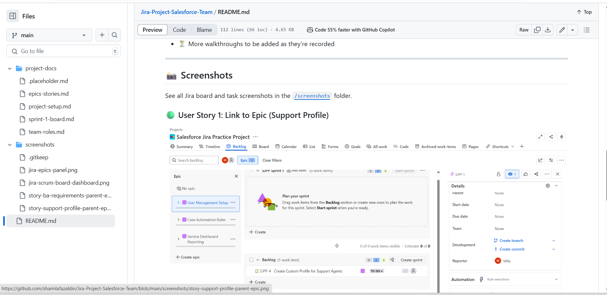
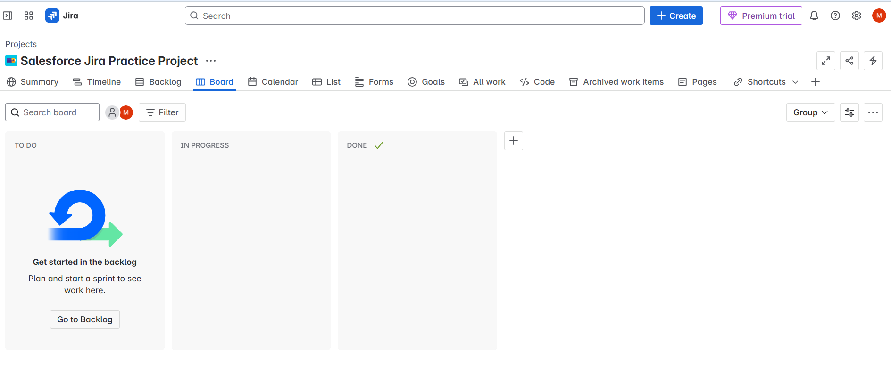
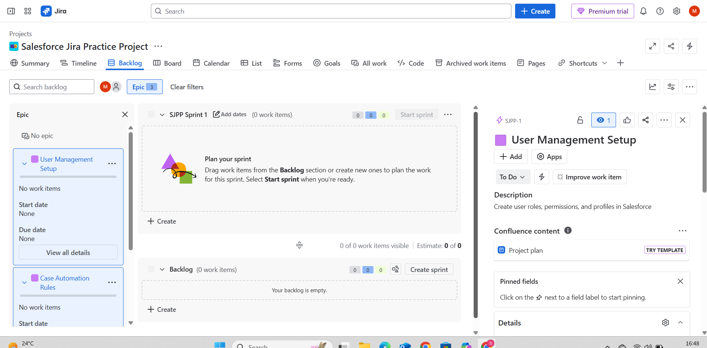

# 🛠️ Jira Learning Project – Salesforce Team Collaboration

This is a 3-hour hands-on project to learn and showcase how to use **Jira Software** for team collaboration, sprint planning, and task tracking — while documenting everything using **GitHub** and recording walkthroughs with **Loom**.

---

## 🧩 Project Scenario

> A fictional Salesforce team is working on a small internal automation project.  
The goal is to simulate how team members (Admins, BAs, Devs) use **Jira to plan, assign, track**, and **review tasks** during a sprint.

---

# 👥 Team Roles

This fictional Salesforce project team is collaborating using Jira to simulate a real-world delivery workflow.

| Name           | Role                  | Responsibility                                                                 |
|----------------|-----------------------|---------------------------------------------------------------------------------|
| Shamila Fazaldin | Salesforce Admin      | Org setup, user management, automation, and Flow builder                        |
| Alex Chen      | Salesforce Admin      | Permission sets, Case automation, reports, and user visibility configuration   |
| Lina Okoro     | Business Analyst      | Requirement gathering, stakeholder interviews, write detailed user stories     |
| Riya Patel     | Business Analyst      | Map user journeys, define acceptance criteria, and backlog grooming            |
| Leo Zhang      | DevOps Engineer       | CI/CD pipelines, metadata deployment, GitHub-Jira integration                  |
| Maya Thompson  | DevOps Engineer       | Sandbox management, release coordination, environment setup                    |

Details documented in [`project-docs/team-roles.md`](./project-docs/team-roles.md)

---

## 📁 Project Documentation

All planning documents are in the `/project-docs` folder:

- `project-setup.md` → Jira board creation, configuration, goals
- `team-roles.md` → Role responsibilities
- `epics-stories.md` → Backlog planning and hierarchy
- `sprint-1-board.md` → Sprint tasks, progress, retrospective notes

- ## 📂 Documented Epics & Stories

| Epic Name                      | Role   | Documented? | Notes                         |
|-------------------------------|--------|-------------|-------------------------------|
| User Management Setup         | Admin  | ✅ Partial   | Story only + Screenshot       |
| Gather Service Requirements   | BA     | ✅ Full      | Epic → Story → Loom + SS      |
| Case Automation Rules         | Admin  | ❌ No        | Jira practice only            |
| Service Dashboard Reporting   | Admin  | ❌ No        | Jira practice only            |
| Service Documentation         | BA     | ❌ No        | Jira practice only            |
| DevOps Deployment Monitoring  | DevOps | ❓ Optional  | You decide if you document it |
| DevOps Sandbox Setup          | DevOps | ❌ No        | Jira practice only            |

---

## 🎥 Video Walkthroughs

Loom video links will be added below as the project progresses:

- 🎥 [Epic + Story for BA in Jira](https://www.loom.com/share/8a267863eeb9475ca02c745c95b8e722?sid=d565a239-41b9-46ed-9ea2-44e78230ed04)
- 🎥 [GitHub Viewing Dashboard](https://www.loom.com/share/d2fd6dda5e6b4891ad4735915bf67712?sid=b71026a2-7565-4263-a7c3-68d5c73b75cb)
- 🎥 [Jira Project Setup (Loom)](https://www.loom.com/share/e379c51c861043369f18cf661ca355bd?sid=1bc3c3ce-6e27-4f52-991d-e071b8f8e813)
- 🎥 [GitHub project-setup.md creation (Loom)](https://www.loom.com/share/f05664ec7754453b86e9acfb19551b27?sid=c26837b9-a7b8-42a8-8642-6c52b40a93ef)
- 🎥 [Github walkthrough (Loom)](https://www.loom.com/share/0c53cb70dbbf464299d284684441c358?sid=9ba617e5-f65c-4efc-9175-8799b4d5490a)
- 🎥 [Jira Epic screenshot upload (Loom)](https://www.loom.com/share/ab9695e681b14ff19d7b4891bd4146b7?sid=f93e0210-3342-4808-8429-8576af140583)
- 🎥 [DevOps Epic 5 & Story](https://www.loom.com/share/20ccc6dccef641f8ab89cad371229dd8?sid=3f783d3c-0835-42d1-a9f9-3e256fe9abc0)

- ⏳ More walkthroughs to be added as they’re recorded

## 📸 Screenshots

See all Jira board and task screenshots in the [`/screenshots`](./screenshots) folder.

### 🖥️ GitHub Repo Dashboard

- 🖼️ **Jira Dashboard View:** 

### 🟢 User Story 1: Link to Epic (Support Profile)

## 📸 Key Screenshot

  

  
  

---

## 🚀 Tools Used

- [Jira Software (Scrum Template)](https://www.atlassian.com/software/jira)
- [GitHub](https://github.com)
- [Loom (Video Walkthroughs)](https://loom.com)

---

## 📌 Purpose

This is a learning portfolio project to demonstrate:

- ✅ How to use **Jira** for project planning & sprint boards
- ✅ How to document professionally using **Markdown in GitHub**
- ✅ How to present work clearly using **screenshots + video**

---

> ⭐ This project is part of a **"Learn by Doing" portfolio series**.  
Check out more projects at: [your portfolio link here]

