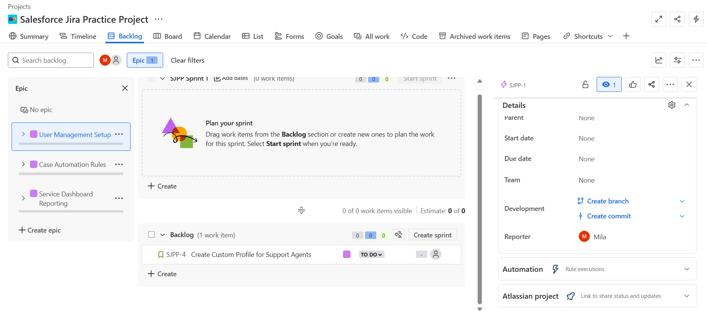
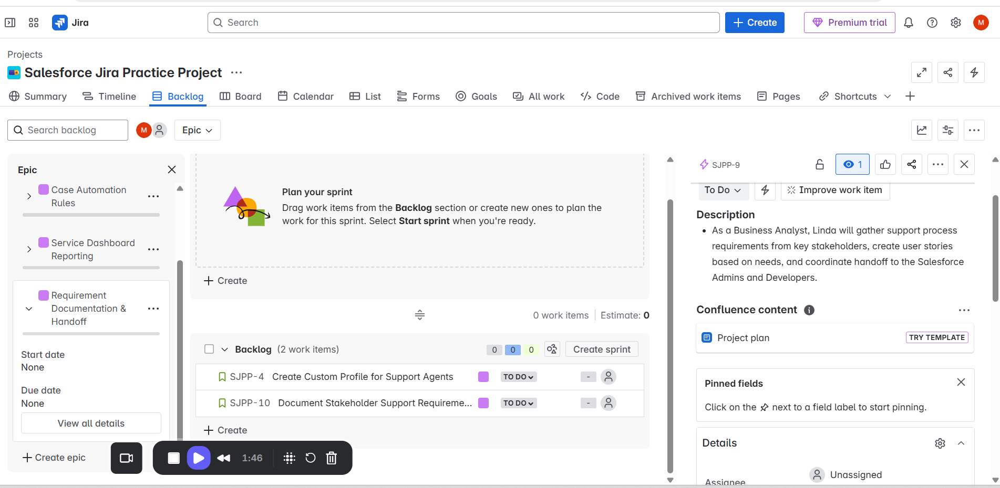

# 📘 Epics & User Stories

This document outlines the Epics and associated User Stories created in Jira for the simulated Salesforce Admin project.

## 📁 Epics

  ## 🧩 EPIC 1: User Management Setup
**Goal:** Enable Salesforce Admins to create, deactivate, and manage users.

### 1. User Management Setup
Create user roles, permissions, and profiles in Salesforce to align with internal support team structure.

## 🟢 User Story 1: Clone Standard User Profile

**Epic:** User Management Setup  
**Summary:** As a Salesforce Admin, I want to clone the Standard User Profile so I can customize permissions for support team members.  
**Acceptance Criteria:**
- Clone the "Standard User" profile.
- Customize object permissions for Cases and Contacts.
- Restrict access to Setup Menu.
**Priority:** High  
**Assignee:** Shamila  
**Due Date:** 2025-06-20

### 🟩 User Story: Custom Support Profile Linked to Epic

## 🧩 EPIC 2: Case Automation Rules  
**Owner:** Alex Chen (Salesforce Admin)  
**Goal:** Automate case assignment and SLA tracking.

🔹 User Stories (Jira Practice Only):
- **STORY-2:** As a Salesforce Admin, I want to create assignment rules to route urgent cases to Tier 2 agents.
- **STORY-3:** As a Salesforce Admin, I want to send SLA breach alerts to supervisors via email.

## 🧩 EPIC 3: Service Dashboard Reporting  
**Owner:** Shamila Fazaldin (Salesforce Admin)  
**Goal:** Create real-time dashboards to monitor SLA compliance, case load, and agent performance.

🔹 User Stories (Jira Practice Only):
- **STORY-4:** As a Salesforce Admin, I want to design a Case SLA Dashboard for support managers.
- **STORY-5:** As a Salesforce Admin, I want to build a workload dashboard for active agents.

---
## 🧩 EPIC 4: ## Requirement Documentation & Handoff
**Goal:** Gather stakeholder input and define technical handoff.

### 🟢 User Story: Document Stakeholder Support Requirements

**Epic:** Requirement Documentation & Handoff  
**Summary:** As a Business Analyst, I want to gather and document stakeholder expectations so that the technical team can build features that meet support needs.  
**Acceptance Criteria:**
- Meet with 3 support leads to understand workflows
- Create a Confluence/Google Doc with summarized needs
- Identify 3–5 key business pain points  
**Priority:** Medium  
**Assignee:** Linda  
**Due Date:** 2025-06-22

### 🟩 Screenshot: Story linked to Epic

### 📹 User Story Creation Walkthrough (BA)

🎥 [Epic + Story for BA in Jira](https://www.loom.com/share/8a267863eeb9475ca02c745c95b8e722?sid=a22220b9-4a8a-4a4a-8a4e-7c6783113e37)

---

## 📝 Notes

- Remaining team roles (2 DevOps + 1 BA) will be used for additional Jira practice, not GitHub documentation.
- All documented stories are also linked in `README.md`.

