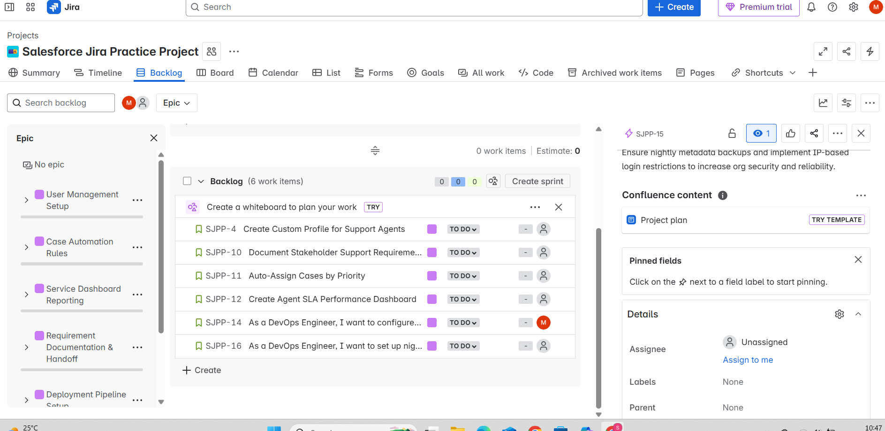

# 📘 Epics & User Stories

This document outlines the Epics and associated User Stories created in Jira for the simulated Salesforce Admin project.

## 📁 Epics

  ## 🧩 EPIC 1: User Management Setup
**Goal:** Enable Salesforce Admins to create, deactivate, and manage users.

### 1. User Management Setup
Create user roles, permissions, and profiles in Salesforce to align with internal support team structure.

## 🟢 User Story 1: Clone Standard User Profile

**Epic:** User Management Setup  
**Summary:** As a Salesforce Admin, I want to clone the Standard User Profile so I can customize permissions for support team members.  
**Acceptance Criteria:**
- Clone the "Standard User" profile.
- Customize object permissions for Cases and Contacts.
- Restrict access to Setup Menu.
**Priority:** High  
**Assignee:** Shamila  
**Due Date:** 2025-06-20

### 🟩 User Story: Custom Support Profile Linked to Epic

---

## 🧩 EPIC 2: Case Automation Rules  
**Goal:** Automate case assignment, SLA tracking, and customer email alerts in Service Cloud.

### 🟢 User Story 2: Priority-Based Case Assignment  

**Epic:** Case Automation Rules  
**Summary:** As a Salesforce Admin, I want new cases to be auto-assigned based on priority, so that urgent requests get faster response.  

**Acceptance Criteria:**
- Create assignment rules based on case priority (High, Medium, Low)
- Test routing logic with mock cases
- Confirm urgent cases are assigned to senior agents

**Priority:** High  
**Assignee:** Alex  
**Due Date:** 2025-06-21

---

## 🧩 EPIC 3: Service Dashboard Reporting  
**Goal:** Build real-time dashboards for management to track case metrics and SLA performance.

### 🟢 User Story 3: Define Dashboard Requirements  

**Epic:** Service Dashboard Reporting  
**Summary:** As a Business Analyst, I want to gather and document reporting requirements from stakeholders so that the Salesforce Admin can build useful dashboards.

**Acceptance Criteria:**
- Meet with support managers to gather metrics they want to see
- Create a dashboard requirements document (charts, KPIs)
- Collaborate with Admin to ensure feasibility in Salesforce reports

**Priority:** Medium  
**Assignee:** Priya  
**Due Date:** 2025-06-21

---
## 🧩 EPIC 4: ## Requirement Documentation & Handoff
**Goal:** Gather stakeholder input and define technical handoff.

### 🟢 User Story: Document Stakeholder Support Requirements

**Epic:** Requirement Documentation & Handoff  
**Summary:** As a Business Analyst, I want to gather and document stakeholder expectations so that the technical team can build features that meet support needs.  
**Acceptance Criteria:**
- Meet with 3 support leads to understand workflows
- Create a Confluence/Google Doc with summarized needs
- Identify 3–5 key business pain points  
**Priority:** Medium  
**Assignee:** Linda  
**Due Date:** 2025-06-22

### 🟩 Screenshot: Story linked to Epic

### 📹 User Story Creation Walkthrough (BA)

🎥 [Epic + Story for BA in Jira](https://www.loom.com/share/8a267863eeb9475ca02c745c95b8e722?sid=a22220b9-4a8a-4a4a-8a4e-7c6783113e37)

---

---

## 🧩 EPIC 5: Deployment Pipeline Setup  
**Goal:** Design and automate the deployment pipeline using GitHub and Salesforce DX to reduce manual errors and increase delivery speed.

### 🟢 User Story 5.1: CI Setup with GitHub Actions  
**Epic:** Deployment Pipeline Setup  
**Summary:** As a DevOps Engineer, I want to configure GitHub Actions for CI so that every code push triggers automated tests and validations.  

**Acceptance Criteria:**  
- Set up `.yml` workflow for PR validation  
- Ensure failed builds block deployment  
- Integrate with GitHub repo  

**Priority:** High  
**Assignee:** Chris  
**Due Date:** 2025-06-22  

---

### 🟢 User Story 5.2: Dev-to-Prod Deployment Automation  
**Epic:** Deployment Pipeline Setup  
**Summary:** As a DevOps Engineer, I want to automate deployment from dev to production using GitHub Actions and Salesforce DX so we reduce manual errors.  

**Acceptance Criteria:**  
- Use Salesforce DX for source tracking  
- Deploy metadata to UAT and Prod with approval gates  
- Notify team on deployment status  

**Priority:** High  
**Assignee:** Chris  
**Due Date:** 2025-06-22  

---

### 🖼️ Screenshot: Jira Dashboard Showing All 6 Epics & Stories

---

## 🧩 EPIC 6: Org Security & Backup Automation

**Summary:** As a DevOps Engineer, I want to set up nightly metadata backups using Salesforce CLI so we can restore quickly in case of failure.

**Goal:** Ensure nightly metadata backups and implement IP-based login restrictions to increase org security and reliability.

### 🟢 User Story 6: Automate Metadata Backups

**Acceptance Criteria:**
- Use Salesforce CLI to retrieve metadata nightly
- Store backups in secure cloud storage
- Set up IP login ranges to restrict unauthorized access
- Monitor backup success/failure status

**Priority:** High  
**Assignee:** Jordan  
**Due Date:** 2025-06-23

---

## 📝 Notes

- Remaining team roles (2 DevOps + 1 BA) will be used for additional Jira practice, not GitHub documentation.
- All documented stories are also linked in `README.md`.

